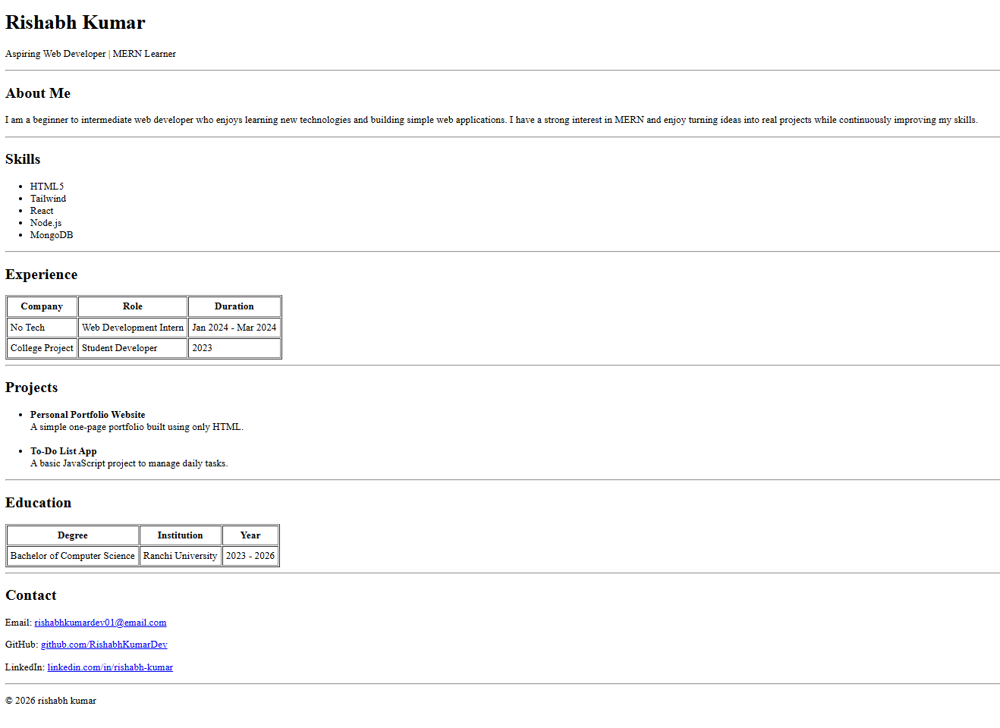

# Portfolio Website (HTML Only)

## Overview
A single-page personal portfolio built using only HTML.  
Includes: Header, About, Skills, Experience, Projects, Education, and Contact sections.

## Setup

### Option 1: Double-click
1. Clone the repo:
   git clone https://github.com/RishabhKumarDev/portfolio
2. Open `index.html` in your browser.

### Option 2: Live Server (VS Code)
1. Open the project folder in VS Code.
2. Right-click `index.html` → Open with Live Server.

## Screenshot

